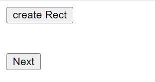

# React Konva

React Konva is a JavaScript library for drawing complex canvas graphics using [React](https://reactjs.org/)

# picture Demo

**f:xCordinateLeftShape**
**g:xCordinateRightShape**
**increase and decrease width and height and radius of shape when click on button**
